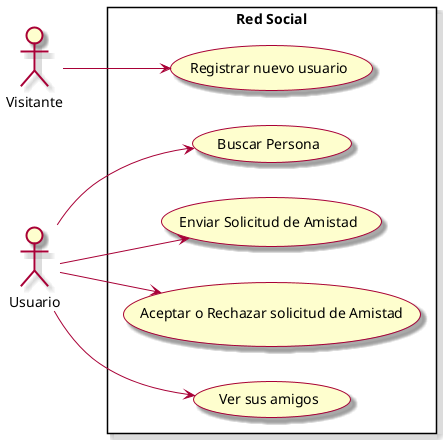

# Casos de Uso

## Diagrama de Casos de Uso

## Listado de Casos de Uso

| # | Nombre |
|---|--------|
| CU01  | [Registrar nuevo usuario](casos-de-uso/CU01-Registrar-nuevo-usuario.md) |
| CU02  | Buscar Persona |
| CU03  | Enviar Solicitud de Amistad |
| CU04  | Aceptar o Rechazar solicitud de Amistad |
| CU05  | Ver sus amigos |